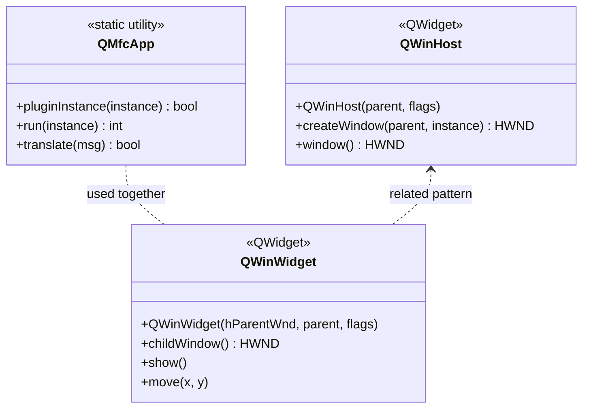

# Library: `qtwinmigrate` — Windows MFC/Qt Bridge

> **Source:** `src/qtwinmigrate/`  
> **CMake target:** `qtwinmigrate` (Windows only)  
> **Back to:** [Architecture Overview](../architecture.md)

## Purpose

`qtwinmigrate` is a third-party compatibility library (originally from Qt Solutions) that enables Qt widgets to be embedded inside a Win32 or MFC (Microsoft Foundation Class) application window. It is used specifically to host the OpenStudio GUI inside the SketchUp plugin on Windows, where SketchUp provides a native Win32 host window.

This module is **compiled only on Windows** (`if(WIN32)` in CMake). It has no effect on macOS or Linux builds.

---

## Key Classes

| Class | File | Description |
|---|---|---|
| `QMfcApp` | [QMfcApp/qmfcapp.h](../../../src/qtwinmigrate/QMfcApp/qmfcapp.h) | Bridges the Qt event loop with an MFC `CWinApp`. Allows Qt to be initialised as a plugin within an existing MFC process. |
| `QWinHost` | [QWinHost/qwinhost.h](../../../src/qtwinmigrate/QWinHost/qwinhost.h) | A `QWidget` subclass that hosts an arbitrary Win32 `HWND` child window inside a Qt widget hierarchy. |
| `QWinWidget` | [QWinWidget/qwinwidget.h](../../../src/qtwinmigrate/QWinWidget/qwinwidget.h) | A `QWidget` that is itself a child of a native `HWND`, allowing Qt widgets to be embedded inside a non-Qt Win32 parent window. |

---

## External Dependencies

| Dependency | Usage |
|---|---|
| **Qt 6** (`QtWidgets`, `QtCore`) | Qt event loop and widget hierarchy integration |
| **Win32 API** (`windows.h`, `commctrl.h`) | Native window handles (`HWND`), message translation |
| **MFC** (optional, link-time) | `QMfcApp` integration with `CWinApp` (only needed for MFC hosts) |

---

## Internal Dependencies

None.

---

## Patterns & Conventions

- **Plugin pattern** — `QMfcApp::pluginInstance()` is the entry point for Qt-as-plugin use. It initialises Qt without creating a new `QApplication` (since one already exists in the host process).
- **Message translation** — `QMfcApp::translate()` must be called from the host's message loop to forward Windows messages to Qt's event dispatcher.
- **Not used in standalone app** — in the standalone `OpenStudioApp` executable, none of these classes are instantiated. They exist in the compiled binary only because the `openstudio_bimserver` target links `qtwinmigrate` on Windows.
