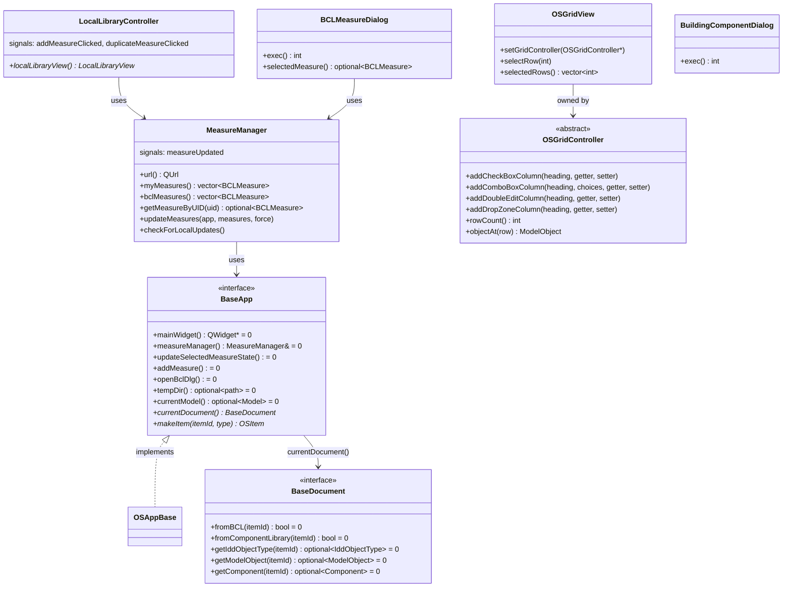
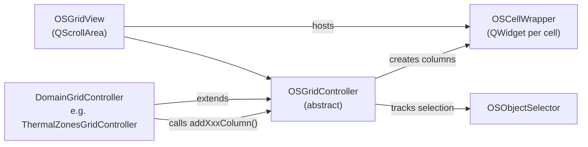
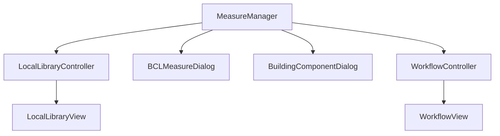

# Library: `shared_gui_components` — Shared UI Widgets

> **Source:** `src/shared_gui_components/`  
> **CMake target:** `openstudio_shared_gui`  
> **Back to:** [Architecture Overview](../architecture.md)

## Purpose

`shared_gui_components` provides the reusable Qt widgets and controllers that are shared between the standalone OpenStudio Application and any plugin host (e.g., the SketchUp plugin). It is designed to be independent of the specific application shell, conforming only to the `BaseApp` interface.

Key responsibilities:
- **Grid system** — a generic multi-column tabular view for OpenStudio model objects
- **Form controls** — typed input widgets for real, integer, boolean, and string model fields
- **Measure management** — discovery, update-checking, and execution of OpenStudio Measures
- **BCL integration** — browse and download building components and measures from NREL's BCL
- **Common dialogs** — network proxy, progress bars, wait dialogs

---

## Key Classes

---

## Grid System in Detail

The grid system powers all multi-column, tabular model views (Thermal Zones, Space Types, Spaces, Facility, Design Days, etc.).

Each concrete grid controller (e.g., `ThermalZonesGridController`, `SpaceTypesGridController`) extends `OSGridController` and calls the `add*Column()` methods in its constructor to declaratively define the column layout. The grid controller reads data lazily from the model as the view scrolls.

---

## Form Controls

All typed input widgets follow the same pattern: they read from and write to a `ModelObject` field via getter/setter callbacks provided by the owning `OSGridController` or inspector view.

| Widget | Purpose |
|---|---|
| `OSDoubleEdit` / `OSDoubleEdit2` | Real-valued field editor with unit conversion support |
| `OSIntegerEdit` / `OSIntegerEdit2` | Integer field editor |
| `OSUnsignedEdit` | Non-negative integer editor |
| `OSLineEdit` / `OSLineEdit2` | String field editor |
| `OSComboBox` / `OSComboBox2` | Enumeration/choice field selector |
| `OSCheckBox` / `OSCheckBox2` | Boolean field toggle |
| `OSSwitch` | Toggle switch for boolean fields (styled alternative to checkbox) |
| `OSQuantityEdit` / `OSQuantityEdit2` | Dimensional quantity editor with SI/IP toggle |
| `OSOptionalQuantityEdit` | Optional dimensional quantity (blank = unset) |

> **Note:** `OSVectorController`, `OSItemId`, `IconLibrary`, `UserSettings`, `OSItem`, `OSDropZone`, and `ModelObjectItem` are now fully in `shared_gui_components` (previously in `openstudio_lib` or `model_editor`). All document/app operations are routed through `BaseApp` virtual methods.

The `2` suffix variants use `std::function` callbacks instead of `QObject` signal/slot; they are preferred in newer code.

---

## Measure & BCL Integration

- `MeasureManager` maintains an in-memory index of all available measures, dedupes by UUID, and manages update-checking against local copies.
- `SyncMeasuresDialog` / `SyncMeasuresDialogCentralWidget` — modal workflow to synchronize project measure versions with the local library.
- `WorkflowController` / `WorkflowView` — displays the ordered list of measures in the project workflow (the Measures tab).

---

## External Dependencies

| Dependency | Usage |
|---|---|
| **Qt 6** (`QtWidgets`, `QtCore`, `QtNetwork`) | All widgets, networking for BCL downloads |
| **OpenStudio SDK** (`BCLMeasure`, `WorkflowJSON`, `OSArgument`) | Measure definitions, workflow serialization, argument types |
| **Boost** | `optional`, path utilities |

---

## Internal Dependencies

| Module | Usage |
|---|---|
| `openstudio_qt_utils` | `Application` singleton, `Utilities` (string/UUID/path conversions), `QMetaTypes` (SDK metatype registration), `OSProgressBar` |

---

## Known Boundary Violations

None. All cross-library includes have been resolved. `OSItem`, `OSDropZone`, and `ModelObjectItem` are fully in `shared_gui_components`; their former dependencies on `OSAppBase`/`OSDocument` are now routed through `BaseApp` virtual methods.

---

## Patterns & Conventions

- **`BaseApp` interface** — all components that need access to the application (e.g., `MeasureManager`, `LocalLibraryController`, `WorkflowController`) use only `BaseApp`, never `OSAppBase`, `OSDocument`, or `MainWindow` directly. `BaseApp` exposes `useClassicCLI()`, `disableDocument()`, and `enableDocument()` so that shared components can call these without depending on `openstudio_lib` types. This keeps the dependency order acyclic.
- **`add*Column()` DSL** — `OSGridController` subclasses define their columns declaratively in their constructor, producing a clean, readable column specification without procedural layout code.
- **Thread safety** — `MeasureManager` uses a `QMutex` to protect its measure index; BCL network requests are made on the Qt network thread.

---

## Key Classes

Class-level documentation is in the corresponding header files under [`src/shared_gui_components/`](../../../src/shared_gui_components/).
