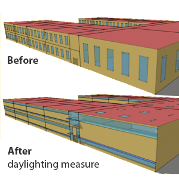

<h1>Welcome to OpenStudio&reg; User Documentation</h1>

This is OpenStudio's user documentation. A brief summary of the content of the site is below. Use the buttons or the horizontal navigation above to learn more about the OpenStudio suite of applications.

  

    

      
 
        

          <h3>Getting Started</h3>
          
This section provides installation instructions, introductory tutorials, and information to get you up and running.

          
<a href="getting_started/getting_started.md" class="btn btn-primary" role="button">Installation &amp; Tutorial</a>

          
Review the list of features and building elements that can be modeled.

          
<a href="getting_started/features.md" class="btn btn-primary" role="button">Current Features</a>

          
<a href="getting_started/roadmap.md" class="btn btn-primary" role="button">Planned Features</a>

        

      

    

    

      
 
        

          <h3>References &amp; Tutorials</h3>
          
Interface guides give detailed overviews of the OpenStudio applications.

          
<a href="reference/sketchup_plugin_interface.md" class="btn btn-primary" role="button">SketchUp Plug-in</a>

          
<a href="reference/openstudio_application_interface.md" class="btn btn-primary" role="button">OpenStudio Application</a>

          
Tutorials cover essential workflows as well as advanced topics.

          
<a href="tutorials/creating_your_model.md" class="btn btn-primary" role="button">Creating Your Model</a>

          
<a href="tutorials/running_your_simulation.md" class="btn btn-primary" role="button">Running Your Simulation</a>

          
<a href="tutorials/radiance_tutorial.md" class="btn btn-primary" role="button">Radiance &amp; OpenStudio</a>

        

      

    

    

      
 
        

          <h3>Speed Up Your Workflow With Measures</h3>
          
Learn what measures are, how to use them for various use cases, and where to find them.

          
<a href="getting_started/about_measures.md" class="btn btn-primary" role="button">About Measures</a>

          
Can't find the measures you want, or need to customize an existing measure? The Measure Writing Guide will help you get started.

          
<a href="reference/measure_writing_guide.md" class="btn btn-primary" role="button">Measure Writing Guide</a>

          
Want to script your entire workflow?  The OpenStudio Command Line Interface can run your measure based workflow quickly and easily.

          
<a href="reference/command_line_interface.md" class="btn btn-primary" role="button">Command Line Interface</a>

        

      

    

  

  

    

      
 
        

          <h3>Comparative Analysis</h3>
          
Learn how to create design alternatives as part of a parametric study using the OpenStudio Parametric Analysis Tool (PAT). Run simulations locally and on the cloud.

          
<a href="reference/parametric_analysis_tool_2.md" class="btn btn-primary" role="button">Parametric Analysis Tool</a>

        

      

    

    

      

        

          <h3>Help &amp; Additional Resources</h3>
          
Find professional training for OpenStudio.

          
<a href="help/training.md" class="btn btn-primary" role="button">Training, Support, &amp; Consulting</a>

           
Check out Unmet Hours, to post a question or search for answers to your energy modeling questions.

          
<a href="https://unmethours.com/questions/scope:all/sort:activity-desc/tags:openstudio/" class="btn btn-primary" role="button">OpenStudio on Unmet Hours</a>

          
Check out this advanced application of OpenStudio for fault detection:

          
<a href="https://github.com/NREL/OpenStudio-fault-models" class="btn btn-primary" role="button">Fault Detection Measures </a>
          
Additional help topics.

          
<a href="help/best_practices.md" class="btn btn-primary" role="button">Best Practices</a>

          
<a href="help/troubleshooting.md" class="btn btn-primary" role="button">Troubleshooting</a>

        

      

    

  

